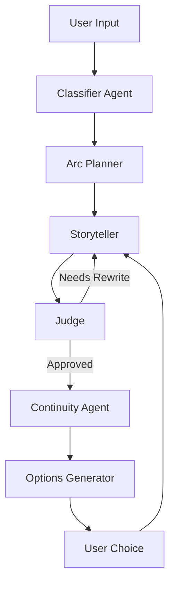

# HippocraticAI-TakeHome-Assignment

Interactive BedTime Story Teller AI Agent

## Overview

This project builds an **AI-powered storytelling experience** where users co-create bedtime stories step-by-step. Instead of generating a full story in a single pass, the system:

- Plans a structured narrative arc
- Generates the story in chunks
- Offers continuation choices
- Maintains long-term story consistency
- Self-evaluates and improves quality iteratively

The result is a **guided, interactive storytelling loop** that feels dynamic, coherent, and engaging.

## System Design

The system is implemented as a **pipeline of 6 specialized agents**, each responsible for a single task:

| Agent | Role |
|------|------|
| **1. Classifier** | Categorizes story and defines strategy |
| **2. Arc Planner** | Builds structured 3-act narrative |
| **3. Storyteller** | Generates story chunks |
| **4. Judge** | Evaluates quality across 3 axes |
| **5. Continuity Agent** | Maintains story memory |
| **6. Options Generator** | Produces arc-aware choices |

## Architecture Flow



## Inspiration: Interactive Narrative Design

The **interactive branching mechanism** is inspired by:

> **Andrew Gordon & Jerry Hobbs (2011)**  
> *“Choice of Plausible Alternatives: An Evaluation of Commonsense Causal Reasoning”*  
> https://vgl.ict.usc.edu/bibtexbrowser.php?key=roemmele_choice_2011&bib=ICT.bib

## Example Interaction


## Installation and Running the code 

```bash
git clone https://github.com/LordZerror/HippocraticAI-TakeHome-Assignment
cd HippocraticAI-TakeHome-Assignment
pip install -r requirements.txt
```

Create a `.env` file:

```bash
OPENAI_API_KEY=your_api_key_here
```

**Running the application**

```bash
python app.py
```

